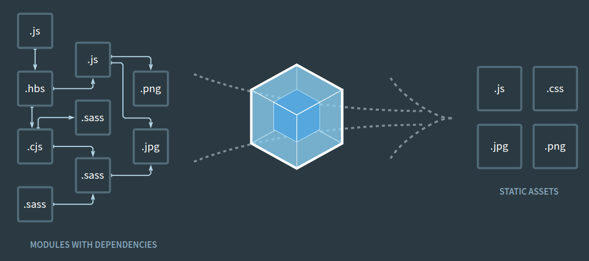
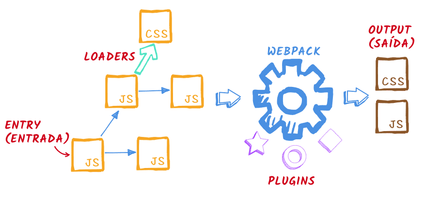

# pesquisa-webpack-loaders
 Pesquisa sobre CSS, Style e Image Loaders do Webpack.

# Webpack

> O **webpack** é um módulo de bundler. Seu principal objetivo é "agrupar" arquivos *JavaScript* para a utilização em um navagador. Além disso ele é capaz de transformar, agrupar e empacotar praticamente qualquer recurso ou ativo, como por exemplo arquivos HTML, CSS, imagens, entre outros.

<figure align="center">
    <a href="https://webpack.js.org/" target="_blank"><figcaption>Fonte:webpack. </figcaption></a>
    
    <figcaption> Figura 01: Fluxo do Webpack. </figcaption>
</figure>

## Instalação

Com o **npm** configurado e inicializado basta fazer o seguinte comando:

```bash
npm install webpack webpack-cli
```

### Arquivo de Configuração

Desde a versão **4.0.0**, o **webpack** não necessita de um arquivo de configuração para agrupar um projeto. Entretanto, inúmeras configurações podem ser feitar através do arquivo `webpack.config.js`. As configurações básicas para esse arquivo são:

```javascript
const path = require('path');

module.exports = {
  entry: './src/index.js',
  output: {
    path: path.resolve(__dirname, 'public'),
    filename: 'bundle.js'
  },
};
```

---
## Loaders do Webpack

> Originalmente. o **webpack** apenas processa arquivos **JavaScript** e **JSON**. **Loaders** permitem o **webpack** processe outros tipos de arquivos e os convertam para módulos válidos que podem ser consumidos pela aplicação.

<figure align="center">
    <a href="https://www.webdevdrops.com/webpack-sem-medo-parte-2-loaders-1d1239df3945/" target="_blank"><figcaption>Fonte: WEB DEV DROPS. </figcaption></a>
    
    <figcaption> Figura 02: Loaders do Webpack. </figcaption>
</figure>

São exemplos de Loaders do webpack:

* CSS Loader;
* File Loader;
* Image Webpack Loader;
* Babel Loader;
* TypeScript Loader;
* Raw Loader.

Os **Loaders** no webpack, em um alto nível, possuem duas propriedades de configuração:

* A `test` que identifica qual arquivo ou arquivos que devem ser transformados;
* A `use`que indica qual loader deve ser utilizado pata confugiração;

Assim um exemplo genérico de conguração seria:

```javascript
module.exports = {
  entry: './src/index.js',
  output: {
    path: path.resolve(__dirname, 'public'),
    filename: 'bundle.js'
  },
  module: {
    rules: [{ test: /\.txt$/, use: 'raw-loader' }],
  },
};

```

Note que um loader é configurado na chave `modules` que possue a proprieade `rules` que *array* que contém os loaders. Para adicionar mais loader, basta acrestar um objeto com as propriedades `test` e `use` dentro do *array* `rules`.

---

## CSS Loader e Style Loader

> O **CSS Loader** é o responsável por interpetrar `@import` e `url()` como `import/require` e resolvê-los. Assim é através desse loader que se é capaz de importar arquivos `.css` pra arquivos `.js`. Dessa forma, ele coleta todas as informaçãoes sobre CSS da aplicação e as colocam em uma *string*.

> Já o **Style Loader** é o responsável por injetar o CSS no DOM (Document Object Model). Assim, ele pega o que é gerado pelo CSS Loader e coloca-o dentro da tag `<style>` no arquivo `index.html`;

**É recomendável e uma boa prática utilizar o `style-loader` em conjunto com o `css-loader`**.

### Instalação

Para instalar o `css-loader` basta fazer:

```
npm install css-loader --save-dev
```

De forma semelhante para o `style-loader` tem-se;

```
npm install style-loader --save-dev
```

### Configuração

No arquivo `webpack.config.js` basta adicionar o objeto ao *array* `rules` da propriedade `modules` da seguinte forma:
```javascript

module.exports = {
  module: {
    rules: [
      {
        test: /\.css$/i,
        use: ["style-loader", "css-loader"],
      },
    ],
  },
};
```

Uma observação importante em relação à propriedade `use` é a sua ordem de execução, em que os loaders são executados sempre na ordem da direita para esquerda, ou de baixo para cima. Assim, nesse exemplo, primeiro executa-se o `css-loader` para em seguida aplicar o `style-loader`.

### Como importar?

Para importar CSS em arquivos JS basta executar o `import` e em seguida colocar o **caminho do arquivo CSS** em relação ao arquivo JS em que o import está sendo utilizado. Por exemplo:

```javascript
import "./assets/css/style.css"
```

---

## File Loader

> O **File Loader** é o responsável por resolver `import/require` de um arquivo em objeto e emitir o arquivo no diretório de saída (*output directory*) . 

**Obs:** Existem outros loaders, como o `image-webpack-loader`, que permitem controlar aspectos importantes como a compressão das imagens durante a importação. Sendo assim uma forma de complemento ao `file-loader`.

### Instalação

Para instalar o `file-loader` basta fazer:

```
npm install file-loader --save-dev
```

### Configuração

No arquivo `webpack.config.js` basta adicionar o objeto ao *array* `rules` da propriedade `modules` da seguinte forma:


```javascript

module.exports = {
  module: {
    rules: [
      {
        test: /\.(png|jpe?g|gif|svg)$/i,
        use: [
          {
            loader: 'file-loader',
            options: {
                outputPath: 'images',
            },
          },
        ],
      },
    ],
  },
};
```

Uma observação importante é que na propriedade `test` ficam os tipos de arquivos a serem tratados pelo `file-loader`. assim na hora da importação se faz necessário verificar se o tipo de arquivo que está sendo importado está incluso nesse propriedade.

### Como importar?

Para importar imagens em arquivos JS basta executar o `import`, em seguida colocar o nome que se deseja atribuir a imagem seguido de um `from` e do **caminho da imagem** em relação ao arquivo JS em que o import está sendo utilizado. Por exemplo:

```javascript
import IMG from "./assets/images/test.png"
```

### File Loader Hash 

> Por padrão, o nome dos arquivos que são emitos pelo `file-loader` são resultantes da aplicação de um *hash MD5* no **conteúdo** do arquivo mais a extensão original do arquivo.

Essa função muito útil durante o desevolvimente web, principalmente devido ao comportamento dos navegadores ao buscarem os arquivos da aplicação. Para acelerar esse processo, os navegares utilizam uma memória cache, na qual eles armazenam, de forma temporária, os arquivos, como as imagens, que formam o site. Assim, ao atualizar a página, eles verificam se o arquivo que será soliticitado já está nessa memória cache, se estiver lá não é necessária uma nova requisição. Essa verificação é feita através do nome do arquivo.

Assim quando um desenvolvedor, no modo tradicional, atualiza um arquivo, sem atualizar o nome, existem grandes chances que ao fazer o deploy esse arquivo não seja atualizado no lado do cliente, a não ser que a cache do navegador seja limpa.

Então utilizando o `file-loader` essa preocupação não existe. Já que o Hash MD5 é único para cada arquivo, pois é baseado no seu conteúdo. Dessa forma, não haverá conflitos nos nomes. Sendo assim uma forma mais confiável de se desenvolver e ter a garantia que os arquivos estarão sendo sempre atualizados.

## Referências:

* [webpack](https://webpack.js.org/)
* [Webpack Loaders, CSS and Style Loaders](https://medium.com/a-beginners-guide-for-webpack-2/webpack-loaders-css-and-sass-2cc0079b5b3a)
* [file-loader](http://man.hubwiz.com/docset/webpack.docset/Contents/Resources/Documents/loaders-file-loader.html)